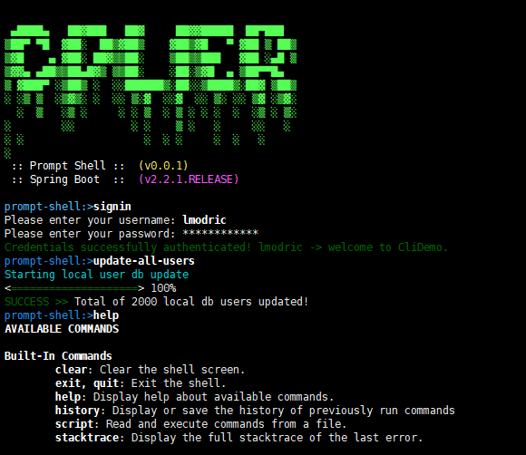

# Spring shell CLI

Spring shell Command line interpreter (CLI) demo app developed with Spring Shell library.



## Usage

first, package this project.

```shell script
mvn clean compile package
```

there are two common ways.

```shell script
java -jar target/xxxx-0.0.1.jar
```

or, decompression the tar.gz run those shell script beyond local jre environment.

```shell script
jre/bin/java -jar target/xxxx-0.0.1.jar
```

enjoy yourself!


